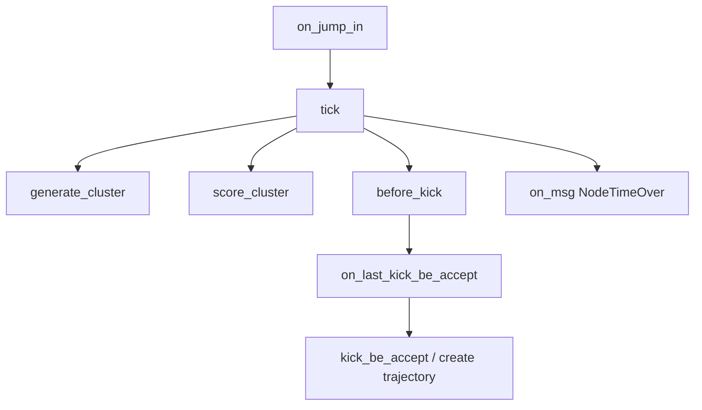

下面按“影响力图 + 传球/直塞链路”列风险点/关键点。

## 1. 全局单例 / 注册表

| 类型 | 位置 | 作用 |
|---|---|---|
| `framesync_data_mgr::Instance()` | `influence_map.cpp:28`, `influence_map.cpp:62` | 读 `InfMapSource` 模板，所有 source 盖章依赖它 |
| `fix_game_settings::get_setting()` / `GET_JSON_PARAMETER` | 多处 | 全局 JSON 参数入口 |
| `InfluenceMap::map_type_str_to_id_dict` | `influence_map.h:78` | source 名到 `uint8_t` ID，全局静态映射 |
| `InfluenceMapUtils.INFLUENCE_MAP_TYPES` | `InfluenceMapUtils.py:3` | Python 图注册表 |
| `InfluenceMapManager.m_maps` | `influence_map_manager.h:67` | 图名到图实例 |
| `QuickGizmos` / `QuickGUI` 注册 | `InfluenceMap.py:17` | 调试渲染全局注册 |

## 2. 状态机 / 状态流

### Pass 动画状态机
`Pass` 是传/直塞落地关键状态机：

关键位置：

- `Pass::on_jump_in` 初始化 `PassAnimData`、播动画、发 `E_START_PASS`：`pass.cpp:27`
- `Pass::tick` 直塞生成 cluster：`pass.cpp:126`
- `Pass::tick` 直塞评分 cluster：`pass.cpp:140`
- `Pass::tick` before-kick 调 `operation_straight_pass::before_kick_be_accept`：`pass.cpp:232`
- `Pass::on_last_kick_be_accept` 分 `PassType::Normal/Straight/...`：`pass.cpp:334`

### 影响力图同步状态机
`InfluenceMapDataSyncPolicy` 四态：

- `PY_ONLY`
- `SYNC_TO_PY`
- `SYNC_TO_CPP`
- `CPP_ONLY`

定义：`influence_map.h:70`  
缓冲初始化：`influence_map.cpp:230`  
同步翻转：`influence_map.cpp:407`

## 3. 缓存字段 / 状态字段

| 字段 | 位置 | 风险 |
|---|---|---|
| 三缓冲 `m_cpp_data/m_py_data/m_mid_data` | `influence_map.h:213` | 读错线程侧数据会旧帧/不同步 |
| source 缓冲 `m_source_info_buffer[3]` | `influence_map.h:218` | source 也随缓冲翻转 |
| `m_last_update_frame` | `influence_map.h:206` | tick 间隔判断依赖 |
| `NormalPassInfluenceMapCache` | `normal_pass_influence_map.h:21` | 同帧同目标缓存普通传球落点 |
| `py_pass_position_cache` | `normal_pass_influence_map.h:92` | 保存上次传球点/速度衰减 |
| `StraightPass` debug 中间图 | `straight_pass_influence_map.h:211` | 仅调试开启后有效 |
| `m_speed_source_data/m_intercept_source_data` | `straight_pass_influence_map.h:207` | 直塞内部 source 数据缓存 |
| `LandPassTask.pass_target_eid/delay_pass/ps_records` | `land_pass_task.h:89` | 任务状态，事件会清 |
| `LandThroughPassTask.max_score_target_point/intercept_probs` | `land_through_pass_task.h:106` | 直塞选人/拦截概率缓存 |
| `PassAnimData.through_point_cluster` | `anim_data.cpp:506` | 直塞 cluster 快照，调试面板读取 |

## 4. 事件 / 消息

### AI Task 监听事件
普通传球监听：

- `E_PASS`
- `E_SHOOTING`
- `E_TOUCHBALL`
- `E_LEAVE_GAME_STATE`
- `E_CHANGE_BALL_OWNER`

位置：`land_pass_task.cpp:579`

直塞监听同类事件：`land_through_pass_task.cpp:294`

事件处理会清或更新任务状态：

- 普通传球：`land_pass_task.cpp:241`
- 直塞：`land_through_pass_task.cpp:196`

### Pass 状态机发事件

| 事件 | 位置 | 作用 |
|---|---|---|
| `E_START_PASS` | `pass.cpp:95` | 传球开始 |
| `E_POSITIONING_FOR_TAKE` | `pass.cpp:82`, `pass.cpp:162`, `pass.cpp:206` | 接球跑位 |
| `E_ON_START_THROUGH_PASS_CLOSE_INTERCEPT` | `pass.cpp:150` | 直塞近距离拦截 |
| `E_ON_THROUGH_PASS_POINT_SET` | `pass.cpp:157` | 直塞点确定 |

### 控制消息

- `NodeTimeOver`：`pass.cpp:281`
- `KickBeLock`：`pass.cpp:314`
- `StateFinish`：`pass.cpp:402`

## 5. Tick / Update 流程

### 全局 AI 并行流程
`FixAIParallelManager`：

1. `merge_phase()`：Python merge + C++ component merge，`fix_ai_parallel_manager.cpp:48`
2. `py_tick()`：主线程 tick Python侧组件，`fix_ai_parallel_manager.cpp:82`
3. AI线程跑 `cpp_parallel_tick()`，组件自实现
4. `sync_data()`：翻转缓冲、同步 C++/Python，`fix_ai_parallel_manager.cpp:94`

### 影响力图更新
`InfluenceMapManager`：

- `py_tick()`：只 tick `is_update_by_py()` 的图，`influence_map_manager.cpp:26`
- `cpp_parallel_tick()`：只 tick `is_update_by_cpp()` 的图，`influence_map_manager.cpp:59`
- `on_sync_data()`：同步 inactive + 所有图翻转，`influence_map_manager.cpp:123`
- 注册后按 `update_seq` 排序，`influence_map_manager.cpp:196`

### Pass 内部更新
直塞 cluster 不是影响力图 tick，而在 Pass 动画 tick 中按 kick 前帧生成/评分：

- 生成帧：`kick_frame - 3`，`pass.cpp:124`
- 评分帧：`kick_frame - 2`，`pass.cpp:125`

## 6. 配置表 / JSON 参数

| 配置 | 使用位置 | 含义 |
|---|---|---|
| `AIInterceptInfMapParam` | `normal_pass_influence_map.cpp:155` | 拦截图参数 |
| `PassInfMapData` | `normal_pass_influence_map.cpp:490` | 普通传球范围/速度衰减 |
| `StraightInfMapData` | `straight_pass_influence_map.cpp:192`, `straight_pass_influence_map.cpp:524` | 直塞图主参数 |
| `LandPassCDataModule` | `land_pass_task.cpp:124` | 普通传球任务参数 |
| `LandThroughCDataModule` | `land_through_pass_task.cpp:104` | 直塞任务参数 |
| `PassDelayDataModule` | `land_pass_task.cpp:125`, `land_through_pass_task.cpp:105` | 延迟传球 |
| `CPPFeatureSwitch` | `pass.cpp:39`, `pass.cpp:304` | 特性开关 |
| `InfluenceMapInitParams.ALL_MAP_TYPE_LIST` | `InfluenceMapInitParams.py:39` | source 类型枚举顺序 |

## 7. 脚本绑定 / C++ 暴露

| 绑定 | 位置 |
|---|---|
| `InfluenceMapManager.register_cpp_influence_map` | `pyinfmap.cpp:1087` |
| `InfluenceMapDataSyncPolicy` 枚举 | `pyinfmap.cpp:1107` |
| `InfluenceMap.load_all_map_type_list` | `pyinfmap.cpp:1171` |
| `StraightPassInfluenceMap.get_random_straight_pass_position/debug_*` | `pyinfmap.cpp:1351` |
| `NormalPassInfluenceMap.get_normal_pass_position/debug_*` | `pyinfmap.cpp:1394` |
| `PassAnimData.through_point_cluster` | `pyhotfix.cpp:3492` |
| Python 装饰器注册图 | `InfluenceMapUtils.py:15` |
| Python 加载 source 类型表 | `InfluenceMap.py:93` |

## 8. 隐式约定

1. 图名必须带队伍后缀：`xxx_0` / `xxx_1`。注册加载见 `InfluenceMapInitParams.py:4`。
2. source 类型顺序不能乱。Python `ALL_MAP_TYPE_LIST` 生成 ID，C++ 靠 ID 反查，见 `InfluenceMap.py:93` + `influence_map.cpp:84`。
3. source 上限 256。超过直接报错并丢弃，`influence_map.cpp:292`。
4. 坐标转换硬编码：网格点转世界点常见 `Fix32Vec3(34 - y, 0, x - 53)`，普通传球见 `normal_pass_influence_map.cpp:111`，直塞见 `straight_pass_influence_map.cpp:338`。
5. `StraightPassInfluenceMap::should_tick()` 永远 false，不靠 manager 周期 tick，靠调用时临时铺图，`straight_pass_influence_map.h:63`。
6. `NormalPassInfluenceMap` 可周期更新，也可在 `get_normal_pass_position` 临时加 source 取点，`normal_pass_influence_map.cpp:105`。
7. 优化模式下不同图同步策略不同，不能随便改；注释已有 desync 风险，`InfluenceMapMgr.py:59`。
8. `PassAnimData` 必须进 msgpack，否则回放/同步丢字段；`through_point_cluster` 已注册，`anim_data.cpp:446`。